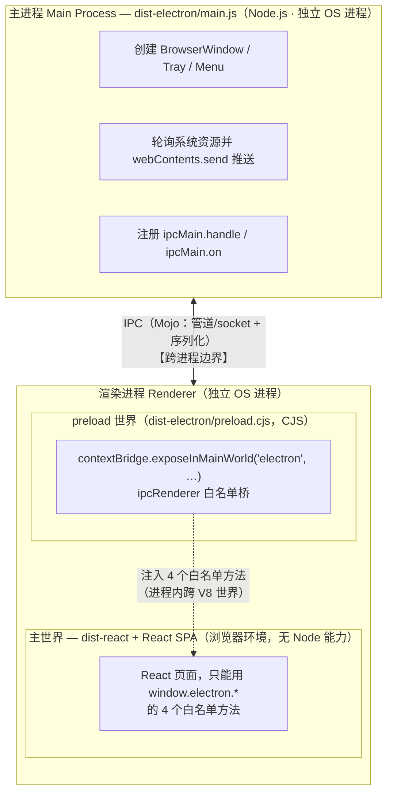
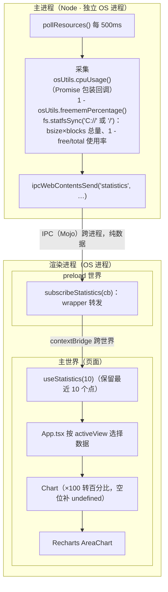

# Electron Course — 项目关键要点

> 一个基于 **Electron + React + TypeScript** 的跨平台桌面应用：实时展示本机 **CPU / 内存 / 磁盘** 使用率。
> 本仓库是 freeCodeCamp 课程的配套示例代码（从 `appId: com.n-ziermann.electron-course` 可知作者为 Nicolas Ziermann），课程链接在 README 中待补（`<ToBeDefined>`）。
>
> 本文梳理项目自身的关键要点，并对项目中用到但仓库未解释的概念，依据官方公开文档补充说明（见 §9 概念速查）。
> Electron 概念与 IPC 的系统讲解见 [ELECTRON-GUIDE.md](./ELECTRON-GUIDE.md)；构建与三份 tsconfig 的深度拆解见 [ENGINEERING.md](./ENGINEERING.md)。
> 图表采用 Mermaid（GitHub 原生渲染；VS Code 需安装 "Markdown Preview Mermaid Support" 扩展）。
> 术语统一遵循 [conventions/terminology.md](./conventions/terminology.md)。

---

## 1. 项目定位与功能

| 功能点 | 说明 | 关键代码 |
|---|---|---|
| 系统资源监控 | 每 500ms 轮询 CPU / RAM / 磁盘使用率，实时绘制面积图 | `src/electron/resourceManager.ts` |
| 类型安全 IPC | 主进程 ↔ 渲染进程通信全部经由统一的类型映射约束 | `types.d.ts`、`src/electron/util.ts`、`src/electron/preload.cts` |
| 隐藏到托盘 | 点关闭不退出，隐藏窗口（macOS 同时隐藏 Dock 图标），从托盘恢复/退出 | `src/electron/main.ts`、`src/electron/tray.ts` |
| 自定义菜单栏 | App 菜单（Quit/DevTools）+ View 菜单（切换 CPU/RAM/STORAGE 视图） | `src/electron/menu.ts` |
| 自定义窗口框架 | `frame: false` 去掉系统标题栏，用 HTML 按钮实现 最小化/最大化/关闭 | `src/electron/main.ts`、`src/ui/App.tsx` |
| 双层测试 | Playwright E2E + Vitest 单元测试 | `e2e/`、`src/electron/tray.test.ts` |

## 2. 技术栈总览

| 层 | 技术 | 版本 | 角色 |
|---|---|---|---|
| 桌面运行时 | Electron | ^32（2024 年发布，内置 Chromium 128 / Node.js 20.x） | 跨平台桌面壳，提供主进程 API |
| UI 框架 | React | ^18.3 | 渲染层视图 |
| 图表 | Recharts | ^2.12 | 基于 React + D3 子模块的声明式图表库 |
| 构建（UI） | Vite | ^5.4 | 渲染层开发服务器 + 生产构建 |
| 构建（主进程） | tsc | ^5.6 | Electron 主进程 / preload 编译 |
| 打包分发 | electron-builder | ^25 | 产出 mac(win/linux) 安装包 |
| E2E 测试 | Playwright | ^1.47 | `_electron.launch` 驱动真实应用 |
| 单元测试 | Vitest | ^2.1 | 主进程模块级测试（mock electron） |
| 系统指标 | os-utils + node:os/fs | — | CPU%、空闲内存%、磁盘 statfs |
| 脚本辅助 | npm-run-all、cross-env | — | 并行跑脚本；跨平台设置环境变量 |

## 3. 整体架构

### 3.1 进程模型（Electron 核心概念，公开资料补充）

Electron 应用由三种运行环境组成：



- **主进程**：Node.js 环境，一个应用只有一份，掌管窗口、托盘、菜单和所有系统能力。
- **渲染进程**：Chromium 环境，运行 React 页面。默认**不开启** `nodeIntegration`、**开启** `contextIsolation` 与 `sandbox`（Electron 5/12/20 起的安全默认值），因此页面里拿不到 Node API。
- **Preload 脚本**：介于两者之间的"桥"，在页面加载前运行，用 `contextBridge` 把少量安全的 IPC 方法挂到 `window.electron` 上——这是 Electron 官方推荐的安全通信形态。

### 3.2 目录结构

```
electron-course/
├── src/
│   ├── electron/               # ── 主进程侧（tsc 编译 → dist-electron/）
│   │   ├── main.ts             # 入口：建窗口、装 IPC、托盘、菜单、关闭拦截
│   │   ├── preload.cts         # 桥接脚本（编译为 CJS 的 preload.cjs）
│   │   ├── resourceManager.ts  # CPU/RAM/磁盘采集 + 500ms 轮询推送
│   │   ├── tray.ts             # 托盘图标 + 右键菜单（Show/Quit）
│   │   ├── menu.ts             # 应用菜单（App + View 两个子菜单）
│   │   ├── util.ts             # isDev + 类型安全 IPC 封装 + 事件来源校验
│   │   ├── pathResolver.ts     # dev/prod 两种环境下 preload/UI/asset 路径
│   │   ├── tray.test.ts        # Vitest 单测（mock 整个 electron 模块）
│   │   └── tsconfig.json       # 主进程专用 tsconfig（NodeNext ESM）
│   └── ui/                     # ── 渲染层（Vite 构建 → dist-react/）
│       ├── App.tsx             # 布局：Header(窗控按钮) + 三个选择卡 + 大图
│       ├── Chart.tsx           # 视图配色、数据补齐（不足 maxDataPoints 补 undefined）
│       ├── BaseChart.tsx       # Recharts AreaChart 封装
│       └── useStatistics.ts    # 订阅 statistics 事件，保留最近 10 个数据点
├── types.d.ts                  # 全局环境类型：IPC 载荷映射 + Window.electron 接口
├── e2e/example.spec.ts         # Playwright E2E
├── electron-builder.json       # 打包配置
├── vite.config.ts              # 渲染层构建（端口 5123 / outDir dist-react / base './'）
└── index.html                  # Vite 入口（含 CSP meta）
```

### 3.3 三份代码、三种编译方式

| 产物 | 源码 | 工具 | 模块格式 | 原因 |
|---|---|---|---|---|
| `dist-electron/*.js` | `src/electron/*.ts`（不含 .cts） | `tsc`（`module: NodeNext`） | **ESM** | `package.json` 有 `"type": "module"`；Electron 28+ 的主进程原生支持 ESM；NodeNext 要求 import 必须写 `.js` 扩展名（见 `main.ts` 里的 `'./util.js'`） |
| `dist-electron/preload.cjs` | `src/electron/preload.cts` | `tsc` | **CommonJS** | `.cts` 后缀强制产出 `.cjs`。沙箱化渲染器中的 preload 对 CJS 支持最成熟稳妥，这也是社区通行做法 |
| `dist-react/` | `src/ui/**` + `index.html` | `Vite` | ESM（浏览器原生） | 开发期走 Vite dev server（5123 端口），生产期 `loadFile` 加载 |

`npm run dev` 用 `npm-run-all --parallel` 同时跑 `dev:react`（Vite）和 `dev:electron`（先转译再 `cross-env NODE_ENV=development electron .`），主进程靠 `isDev()` 判断加载 `http://localhost:5123` 还是本地文件。

## 4. 核心机制

### 4.1 类型安全 IPC —— 本项目最大的亮点

`types.d.ts` 是**全局环境类型文件**（无 import/export，两个 tsconfig 通过 `"types": ["./types"]` 各自引入），主进程、preload、渲染层**三端共享同一份类型**，无需相互 import：

```ts
type EventPayloadMapping = {
  statistics: Statistics;      // main → renderer，周期推送
  getStaticData: StaticData;   // renderer → main，请求-响应
  changeView: View;            // main → renderer，菜单切换视图
  sendFrameAction: FrameWindowAction; // renderer → main，窗控按钮
};
```

围绕它封装了三个泛型工具（`src/electron/util.ts`），`Key extends keyof EventPayloadMapping` 保证频道名与载荷类型一一对应，任何一端改类型，另一端立即编译报错：

| 封装 | 底层 API | 通信形态 | 项目中的使用 |
|---|---|---|---|
| `ipcMainHandle(key, handler)` | `ipcMain.handle` | 请求-响应（renderer `invoke`，有返回值 Promise） | `getStaticData` |
| `ipcMainOn(key, handler)` | `ipcMain.on` | 单向发消息（renderer `send`，无返回） | `sendFrameAction`（CLOSE/MAXIMIZE/MINIMIZE） |
| `ipcWebContentsSend(key, wc, payload)` | `webContents.send` | 主进程主动推送（renderer `on` 订阅） | `statistics`、`changeView` |

preload 侧对应封装了 `ipcInvoke / ipcOn / ipcSend`，并让订阅函数返回**取消订阅函数**（`ipcRenderer.off`），供 React `useEffect` 清理，防止内存泄漏。

### 4.2 安全设计

1. **不关闭任何安全默认项**：未设置 `nodeIntegration: true` / `contextIsolation: false` / `sandbox: false`，渲染层默认零 Node 能力。
2. **最小暴露面**：`contextBridge` 只暴露 4 个方法，IPC 频道由主进程白名单式注册。
3. **事件来源校验**（`util.ts` 的 `validateEventFrame`）：每个 `ipcMain` 事件都检查 `event.senderFrame.url`——开发环境放行 `localhost:5123`，生产环境必须精确等于 `pathToFileURL(dist-react/index.html)`，否则抛出 `Malicious event`。防止其他窗口/iframe 伪造 IPC 消息（对应官方安全清单中的"验证发件方"条目）。
4. **CSP**：`index.html` 中的 meta 策略 `default-src 'self'; style-src 'self' 'unsafe-inline'; script-src 'self'`，禁止外部脚本与内联脚本。

### 4.3 资源采集与推送链路



静态数据（CPU 型号、总内存 GB、总磁盘 GB）由渲染层挂载时一次 `invoke('getStaticData')` 拉取。注意：

- `fs.statfsSync` 需要 **Node 18.15+ / 19.6+**（代码注释 "requires node 18"，Electron 32 内置 Node 20，满足）。
- 磁盘路径硬编码：Windows 用 `C://`，其余平台用 `/`。
- 容量换算用十进制 GB（÷1e9）；`osUtils.totalmem()` 返回 MB，故 ÷1024 得 GB。

### 4.4 自定义窗口框架

`BrowserWindow({ frame: false })` 去掉系统标题栏（Windows/Linux 上菜单栏随窗口边框一起消失——这正是 main.ts 注释提醒的取舍）。Header 里的三个按钮通过 IPC 触发主进程 `mainWindow.close()/maximize()/minimize()`。

### 4.5 隐藏到托盘（而非退出）

`handleCloseEvents` 用 `willClose` 标志区分"真退出"与"假关闭"：

| 事件 | 行为 |
|---|---|
| `window.close` 且 `!willClose` | `preventDefault()` + 隐藏窗口；macOS 再 `app.dock.hide()` |
| `app.before-quit` | 置 `willClose = true`，放行真正的关闭 |
| `window.show` | 重置 `willClose = false` |

托盘（`tray.ts`）图标按平台选择：macOS 用 `trayIconTemplate.png`（模板图，自动适配深浅色菜单栏），其余用 `trayIcon.png`；右键菜单提供 Show（恢复窗口 + `dock.show`）与 Quit。

### 4.6 自定义菜单

`Menu.setApplicationMenu` 挂两个子菜单：

- **App**（macOS 上 label 为 undefined，直接显示应用名）：Quit、DevTools（仅 `isDev()` 可见）。
- **View**：CPU / RAM / STORAGE 三项，点击经 `ipcWebContentsSend('changeView', …)` 通知渲染层切换大图视图（渲染层左侧的三个选择卡也能本地切换，两条路径汇合到同一个 `activeView` state）。

由于生产环境是 `frame: false`，Windows/Linux 上菜单不显示（macOS 系统菜单栏仍可见），此处主要作为课程教学与 E2E 断言对象存在。

## 5. 工程化细节

### 5.1 双 tsconfig

| 文件 | 服务对象 | 要点 |
|---|---|---|
| `tsconfig.json` | UI 层（`src/ui`） | `noEmit`（Vite 负责编译）、`jsx: react-jsx`、**exclude `src/electron`**、`references` 指向 `tsconfig.node.json`（project references，覆盖 `vite.config.ts`） |
| `src/electron/tsconfig.json` | 主进程 | `strict` + `module: NodeNext`（ESM 输入输出）+ `outDir: dist-electron` + 引入根 `types.d.ts` |

### 5.2 路径解析（dev/prod 差异，`pathResolver.ts`）

生产打包后应用被 electron-builder 装进 **asar 归档**，`app.getAppPath()` 指向 asar 内部；`extraResources` 把 `preload.cjs` 和 `src/assets/**` 额外复制到 asar 之外的 `Resources/` 目录。所以统一用 `isDev() ? '.' : '..'` 从 `app.getAppPath()` 出发定位——生产环境 `..` 恰好跳出 asar 到达 Resources。

| 函数 | dev | prod |
|---|---|---|
| `getPreloadPath` | `./dist-electron/preload.cjs` | `<resources>/dist-electron/preload.cjs` |
| `getUIPath` | `./dist-react/index.html` | `<asar>/dist-react/index.html` |
| `getAssetPath` | `./src/assets` | `<resources>/src/assets` |

### 5.3 Vite 配置要点

- `base: './'`：产物用相对路径引用资源，才能被 `loadFile`（`file://` 协议）正确加载——Electron + Vite 的必配项。
- `server.port: 5123 + strictPort: true`：端口固定且被占用即报错，与 `main.ts` 的 `loadURL('http://localhost:5123')`、`validateEventFrame` 的放行域名、Playwright `webServer.url` 四处联动。

## 6. 测试体系

### 6.1 Playwright E2E（`e2e/example.spec.ts`）

- 用 `@playwright/test` 的 `_electron.launch({ args: ['.'], env: { NODE_ENV: 'development' } })` 启动**真实 Electron 应用**（该 API 官方标注为 experimental）。
- `playwright.config.ts` 的 `webServer` 自动先起 `npm run dev:react`（5123 端口），本地复用已存在的 server，CI 强制新起。
- `NODE_ENV=development` 使 `isDev()` 为真 → 应用加载 dev server 而非磁盘文件。
- 自定义 `waitForPreloadScript`：每 100ms 轮询 `window.electron` 是否注入完成，规避 preload 未就绪的竞态。
- 用例：① 点击 `#minimize` 后在**主进程侧** `evaluate` 断言窗口 `isMinimized()`；② 断言应用菜单结构（2 个顶级菜单、各子菜单项数、View 标签）。

### 6.2 Vitest 单测（`src/electron/tray.test.ts`)

- `vi.mock('electron', …)` 整体替换 electron 模块（Tray/app/Menu 均 mock）。
- 断言 `Menu.buildFromTemplate` 收到的模板结构，并**直接调用模板里的 click 回调**验证副作用（`mainWindow.show`、`app.dock.show`、`app.quit` 被调用）。
- 注意：`package.json` 的 `test:unit` 是 `vitest src`，交互终端下会进入 **watch 模式**；CI 建议改用 `vitest run`。

## 7. 构建与分发

```
npm run dist:mac    → DMG        (arm64, Apple Silicon)
npm run dist:win    → portable + msi  (x64)
npm run dist:linux  → AppImage   (x64)
```

统一流程：`transpile:electron`（tsc 主进程）→ `build`（tsc 类型检查 UI + Vite 产出 dist-react）→ `electron-builder`。

`electron-builder.json` 关键项：

| 配置 | 值 | 含义 |
|---|---|---|
| `appId` | `com.n-ziermann.electron-course` | 应用唯一标识（macOS 签名/更新、Windows 注册表均依赖它） |
| `files` | `dist-electron`, `dist-react` | 进入 asar 归档的内容（默认开启 asar 打包） |
| `extraResources` | `dist-electron/preload.cjs`, `src/assets/**` | 复制到 asar 外的 Resources 目录（配合 §5.2 路径解析） |
| `icon` | `./desktopIcon.png` | 应用图标源图（≥512×512 的 png，builder 自动转各平台格式） |
| win target | `portable` + `msi` | 免安装单文件 exe + Windows 安装包 |
| mac target | `dmg` | macOS 磁盘映像安装器 |

## 8. 关键数据流清单

| # | 链路 |
|---|---|
| 1 | `resourceManager.pollResources`（500ms）→ `statistics` → preload 订阅 → `useStatistics`（滑窗 10 点）→ `Chart` |
| 2 | `App` 挂载 → `invoke('getStaticData')` → `ipcMainHandle('getStaticData')` → `getStaticData()` 返回 CPU 型号/总内存/总磁盘 |
| 3 | 菜单 View 点击 → `changeView` → preload 订阅 → `setActiveView`（与左侧选择卡点击等价） |
| 4 | Header 按钮 → `sendFrameAction`（send/on 单向）→ 主进程 switch → 窗口 minimize/maximize/close |
| 5 | close 被拦截 → 隐藏到托盘（+macOS 隐藏 Dock）；托盘 Show/Quit 恢复或退出 |

## 9. 概念速查（公开资料补充）

仓库中用到但未展开的概念，按官方文档补全：

| 概念 | 一句话解释 | 出处 |
|---|---|---|
| Electron 进程模型 | 主进程（Node，唯一）+ 渲染进程（Chromium，多窗口多份）+ preload 桥接 | [Process Model](https://www.electronjs.org/docs/latest/tutorial/process-model) |
| contextIsolation | 默认开启（Electron 12 起）：preload 与页面运行在隔离的 JS 上下文，杜绝原型链污染直取内部对象 | [Context Isolation](https://www.electronjs.org/docs/latest/tutorial/context-isolation) |
| contextBridge | preload 中向页面安全暴露 API 的唯一推荐手段 | [contextBridge API](https://www.electronjs.org/docs/latest/api/context-bridge) |
| sandbox | 默认开启（Electron 20 起）：渲染进程运行在 OS 沙箱，无 Node 能力 | [Sandboxed Renderer](https://www.electronjs.org/docs/latest/tutorial/sandbox) |
| IPC 三形态 | `invoke/handle` 请求-响应；`send/on` 单向消息；`webContents.send` 主→渲染推送 | [IPC 教程](https://www.electronjs.org/docs/latest/tutorial/ipc) |
| Electron 中的 ESM | Electron 28+ 主进程支持 ESM；`.cts/.cjs` 后缀在 `"type": "module"` 包中强制 CJS；NodeNext 模式下 import 必须带 `.js` 扩展名 | [ESM 支持](https://www.electronjs.org/docs/latest/tutorial/esm) |
| Electron 安全清单 | 保持安全默认值、暴露最小 API、校验 `senderFrame`、配置 CSP 等 | [Security](https://www.electronjs.org/docs/latest/tutorial/security) |
| frameless window | `frame:false` 去系统边框；Win/Linux 菜单栏随之消失，需自绘窗控按钮 | [Custom Window Frames](https://www.electronjs.org/docs/latest/tutorial/custom-window-styles) |
| Tray / macOS 模板图标 | 托盘常驻图标；macOS 文件名带 `Template` 自动按深浅色反色 | [Tray API](https://www.electronjs.org/docs/latest/api/tray) |
| `fs.statfsSync` | 同步取文件系统统计（Node 18.15+/19.6+ 提供），bsize×blocks=总量 | [Node fs 文档](https://nodejs.org/api/fs.html#fsstatfspath-options-callback) |
| asar | electron-builder 默认把代码打成的单一归档格式，Electron 可直接读取 | [asar 教程](https://www.electronjs.org/docs/latest/tutorial/asar) |
| DMG / MSI / AppImage / portable | macOS 磁盘映像 / Windows 安装包格式 / Linux 免安装自包含可执行 / Windows 免安装单文件 exe | [electron-builder](https://www.electron.build/) |
| Vite `base: './'` | 产物改用相对路径引用资源，是 `file://` 加载 SPA 的前提 | [Vite 共享配置](https://vitejs.dev/config/shared-options.html#base) |
| Playwright `_electron` | 官方实验性 Electron 支持：`_electron.launch` 起应用、`firstWindow()` 拿页面、`electronApp.evaluate` 进主进程执行 | [Playwright Electron](https://playwright.dev/docs/api/class-electron) |
| npm-run-all | `--parallel` 并发执行多个 npm scripts | [npm-run-all](https://www.npmjs.com/package/npm-run-all) |
| cross-env | 跨平台（尤其 Windows）设置环境变量，此处设 `NODE_ENV` | [cross-env](https://www.npmjs.com/package/cross-env) |
| os-utils | 轻量系统指标库：`cpuUsage(cb)` 回调式取 CPU%、`freememPercentage()`、`totalmem()`（单位 MB） | [os-utils](https://www.npmjs.com/package/os-utils) |
| Recharts | React 声明式图表库；`ResponsiveContainer` 自适应父容器，`AreaChart/Area` 画面积图 | [recharts.org](https://recharts.org/) |

## 10. 常用命令

```bash
npm run dev          # 并行：Vite(5123) + 转译并启动 Electron（开发模式）
npm run build        # tsc 类型检查(UI) + Vite 生产构建 → dist-react/
npm run test:e2e     # Playwright（自动拉起 dev server + Electron）
npm run test:unit    # Vitest（交互终端下为 watch 模式）
npm run dist:win     # 打 Windows 包（portable + msi, x64）
npm run dist:mac     # 打 macOS 包（dmg, arm64）
npm run dist:linux   # 打 Linux 包（AppImage, x64）
```

## 11. 注意事项与可改进空间

1. **课程链接待补**：README 的 `<ToBeDefined>` 未填。
2. **dev 启动竞态**：`npm-run-all --parallel` 下 Electron 可能先于 Vite 就绪而白屏，需手动重启或改用串行等待（E2E 场景由 Playwright `webServer` 解决了此问题）。
3. **磁盘路径硬编码**：Windows 固定 `C://`，无法监控其他盘；可用 `fs.readdirSync`/`wmic` 枚举卷。
4. **轮询永不停止**：`pollResources` 的 `setInterval` 无清理路径（窗口隐藏到托盘后仍在推送）。
5. **`test:unit` 脚本**建议改为 `vitest run`，避免 CI 中进入 watch。
6. **图标资源重复打包**：`src/assets/**` 同时进了 asar（`files` 未排除 src）与 extraResources，可精简。
7. **窗控体验**：自绘按钮缺少双击标题栏最大化、窗口拖拽区（`-webkit-app-region: drag`）等原生细节。
