# Electron 核心概念学习指南

> 配套阅读：[ARCHITECTURE.md](./ARCHITECTURE.md)（本项目结构与关键要点）。
> 本文讲解 Electron 的核心概念与架构，重点深入 **IPC**、**Preload** 与底层原理（Mojo / contextBridge），所有概念均对应到本仓库的真实代码。
> 图表采用 Mermaid：GitHub 原生渲染；VS Code 需安装 "Markdown Preview Mermaid Support" 扩展后预览。**所有图统一标注进程归属：主世界（页面）与 preload 世界同属一个渲染进程（OS 级），主进程是独立 OS 进程。**
> 术语统一遵循 [conventions/terminology.md](./conventions/terminology.md)。

---

## 1. Electron 是什么

Electron = **Chromium**（负责渲染界面）+ **Node.js**（提供系统能力）+ **一层原生 API 胶水**（窗口、菜单、托盘、通知等）。它让你用 Web 技术（HTML/CSS/JS/React）写出原生桌面应用。VS Code、Discord、Slack、Figma 桌面版都是 Electron。

发版节奏跟随 Chromium，约每 8 周一个主版本。本项目用 Electron 32（内置 Chromium 128 / Node 20）。

## 2. 架构核心：进程模型

Electron 应用不是"一个程序"，而是**一组进程**：

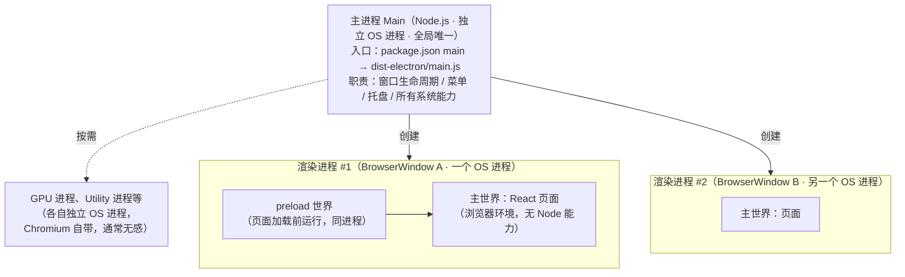

三种角色：

| 角色 | 环境 | 进程归属 | 本项目对应 |
|---|---|---|---|
| **主进程** | Node.js | 独立 OS 进程，全局唯一 | `src/electron/main.ts` |
| **渲染进程** | Chromium | 每个 `BrowserWindow` 一个独立 OS 进程 | `src/ui/`（React 应用） |
| **preload 世界** | 渲染进程内的隔离 V8 Context | **与主世界同一个渲染进程**（非独立进程） | `src/electron/preload.cts` |

### 为什么强制分离？

1. **安全**：渲染进程展示的内容本质是"不可信代码"（可能被 XSS 注入）。如果网页能直接 `require('fs')`，一个 XSS 漏洞就等于整台电脑沦陷。所以 Electron 把 Node 能力收走，锁在主进程里。
2. **稳定性**：Chromium 多进程架构下，页面崩溃只死一个渲染进程，应用本身（主进程）还活着。
3. **权限最小化**：渲染进程需要系统能力时，只能通过 IPC 向主进程"申请"——每次申请都经过你写的、可审计的代码。

### 安全默认值的演进（面试常考）

| 版本 | 变化 |
|---|---|
| Electron 5 | `nodeIntegration` 默认 **false**（网页拿不到 Node） |
| Electron 12 | `contextIsolation` 默认 **true**（preload 与页面 JS 上下文隔离） |
| Electron 20 | `sandbox` 默认 **true**（渲染进程跑在 OS 沙箱里） |

本项目（`src/electron/main.ts:9`）创建窗口时**没有显式设置任何 webPreferences 安全项**，全部吃安全默认值——这就是现代 Electron 的正确姿势。

## 3. 必备的核心对象

| 对象 | 职责 | 本项目示例 |
|---|---|---|
| `app` | 应用生命周期：`ready`、`before-quit`、`window-all-closed` 等；现代写法 `await app.whenReady()` | `main.ts:8`、`main.ts:61` |
| `BrowserWindow` | 一个窗口（= 一个渲染进程）；`webPreferences` 决定该进程能力边界 | `main.ts:9` |
| `webContents` | 窗口里"页面"的控制器，主进程向渲染进程推送消息的句柄 | `resourceManager.ts:14` |
| `Menu` / `Tray` | 应用菜单 / 托盘 | `menu.ts`、`tray.ts` |
| Utility Process | CPU 密集任务另开 Node 子进程（Electron 22+），避免阻塞主进程 | 本项目未用 |

## 4. Preload 深入：编译与运行两个层面

沙箱化的渲染进程里，React 代码**看不到** `ipcRenderer`。唯一例外是 **preload 脚本**——它在页面 JS 执行之前运行，是三端中唯一同时接触"特权 API"与"页面上下文"的角色。本项目的 preload 是 `src/electron/preload.cts`（38 行），下面先从**编译**、**运行**两个层面看清它，再看 contextBridge 的暴露面设计。

### 4.1 编译层面：从 `preload.cts` 到 `preload.cjs`

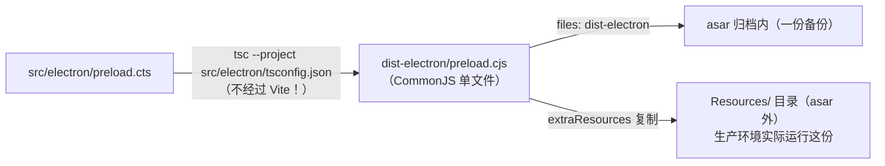

| 关注点 | 说明 |
|---|---|
| **谁编译它** | `tsc`（`src/electron/tsconfig.json`，`module: NodeNext`）。项目有两条独立编译管线：UI 归 Vite，主进程 + preload 归 tsc；UI 的 `tsconfig.json` 用 `exclude: ["src/electron"]` 与之隔离 |
| **为什么是 `.cts`** | 根 `package.json` 有 `"type": "module"`，所有 `.js` 默认按 ESM 处理。`.cts` 是 CommonJS 的"逃生舱"——无论包 type 是什么，`.cts` 一律产出 `.cjs`。于是**主进程走 ESM、preload 走 CJS**，两种格式在同一仓库共存 |
| **为什么选 CJS** | 沙箱化 preload 对 CommonJS 支持最成熟稳妥（社区通行做法）；ESM preload（Electron 28+ 可用）有必须单文件等限制 |
| **tsc 做了什么** | ① 剥离全部类型信息——泛型 `<Key extends keyof …>`、`satisfies Window['electron']`、参数注解都是**编译期概念**，产出后消失，运行时零开销；② `require('electron')` 本就是 CJS 语法，原样保留 |
| **类型从哪来** | 源文件一行 `import` 都没有：`EventPayloadMapping`/`Window` 来自根目录 `types.d.ts`（经 tsconfig `"types": ["../../types"]` 注入的全局环境类型）；`Electron.IpcRendererEvent` 来自 electron 包自带的 `Electron` 全局命名空间 |

### 4.2 运行层面：进程归属、加载时机、生命周期

**谁、何时、在哪加载它：**

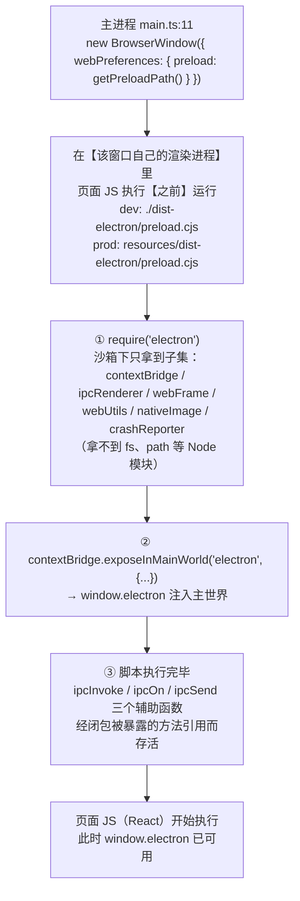

**进程归属：preload 世界不是独立进程。** 它与页面主世界住在同一个渲染进程里——同一个 OS 进程、同一个进程 ID、同一个 V8 堆与 GC。把它们分开的不是进程边界，而是 **V8 Context 边界**（JS 引擎层的"世界"）：

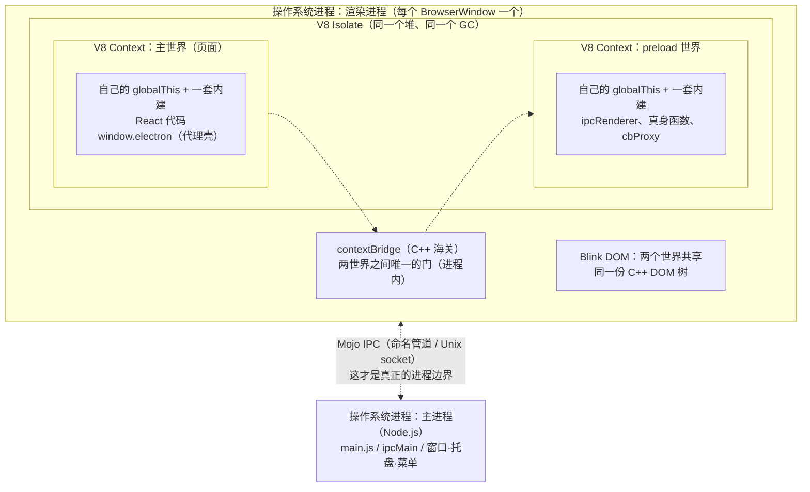

| 事实 | 含义 |
|---|---|
| 同进程、同 V8 Isolate、同堆、同 GC | preload 世界与页面对象在同一个垃圾回收器管辖下 |
| 各自独立的 globalThis + 各自一套内建 | 主世界污染 `Array.prototype`，preload 世界毫无感觉 |
| DOM 是同一份 C++ 对象 | preload 世界里 `document` 也能操作页面 DOM |
| 渲染进程主线程轮流执行两个世界的 JS | 谁跑死循环，另一个也冻结 |

**三级隔离阶梯**（理解"谁和谁隔在哪一层"的关键）：

| 级别 | 边界 | 谁能跨 | 项目里的对应 |
|---|---|---|---|
| 0：同一个世界 | 无 | 直接互访 | React 组件之间 |
| 1：同进程、跨世界 | V8 Context | **只有 C++**（contextBridge） | 主世界 ↔ preload 世界 |
| 2：跨进程 | OS 进程（+ Mojo 管道） | 只有序列化消息（IPC） | preload 世界 ↔ 主进程；两个窗口的渲染进程之间 |

动手验证：

```js
// ① preload 里加一行 console.log —— 出现在同一个 DevTools 控制台（同进程证据）
// ② DevTools 跑 while(true){} —— 窗口连同 preload 世界一起冻结（同线程）
// ③ 渲染进程崩溃 → 两个世界一起消失；主进程还活着（还能弹"页面无响应"）
// ④ 菜单 → 更多工具 → 任务管理器：每窗口一个 Renderer Process，没有 preload 专属进程
```

**生命周期速查：**

| 事件 | 行为 |
|---|---|
| 窗口创建 / 页面 reload | preload **重新执行一遍**（开发时改了 preload，需重载窗口或重启应用才生效） |
| 暴露的 4 个方法 | 挂在 `window` 上，随窗口（渲染进程）存活 |
| `ipcOn` 注册的监听 | 常驻直到 `off`，依赖 UI 调用返回的 unsub 清理 |
| 页面导航 / 渲染进程销毁 | `window.electron` 随之消失，未退订的监听随进程销毁 |

dev 与 prod 的**唯一差异是路径**，代码本身是同一份 `.cjs`。

> E2E 测试里的 `waitForPreloadScript`（`e2e/example.spec.ts:6`）每 100ms 轮询 `window.electron`，等待的就是"注入完成"这个瞬间。

### 4.3 contextBridge：暴露面设计

因为 `contextIsolation` 开启，preload 和页面运行在**两个隔离的 JS 世界**（注意：是同一个渲染进程里的两个世界），直接 `window.foo = xxx` 页面拿不到，必须用 `contextBridge`：

```js
// src/electron/preload.cts:3 —— 本项目真实代码
electron.contextBridge.exposeInMainWorld('electron', {
  subscribeStatistics: (callback) => ipcOn('statistics', callback),
  getStaticData: () => ipcInvoke('getStaticData'),
  sendFrameAction: (payload) => ipcSend('sendFrameAction', payload),
})
```

从那以后，页面里只能用 `window.electron` 上这 **4 个方法**，仅此而已。

> ⚠️ **经典反面教材**（官方安全手册明确禁止）：
> ```js
> contextBridge.exposeInMainWorld('ipc', ipcRenderer)  // 千万别这样！
> ```
> 这等于把所有后门开放给网页。暴露的应该是**语义化动词**（`getStaticData`、`sendFrameAction`），而不是**通用入口**。

细节：`preload.cts:14` 末尾的 `satisfies Window['electron']`——用 `types.d.ts:26` 里 UI 侧声明的 `Window` 接口反向校验 preload 的实现，类型对不上立即编译报错。

---

## 5. IPC 深入讲解（重点）

### 5.1 原理篇：Mojo、函数代理与 contextBridge 的实现

#### 5.1.1 先建立分层认知：两道性质不同的边界

从页面按钮到主进程，要穿过**两道边界**——一道在进程内（跨 JS 世界），一道在进程间（跨操作系统进程）：

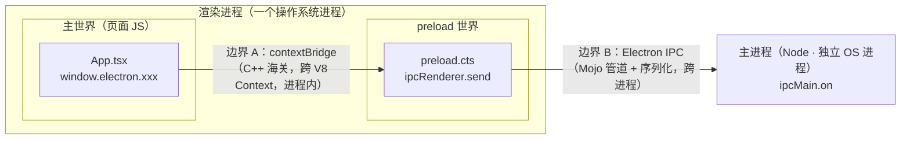

#### 5.1.2 IPC 的原理：自底向上看四层

**第 1 层：操作系统。** 主进程与渲染进程是两个进程，虚拟内存空间完全隔离，任何传数据都必须经过内核机制。Chromium 的选择：Windows 用**命名管道**，POSIX 用 **Unix domain socket**。渲染进程是主进程 spawn 出来的子进程，诞生时就继承了这条通道的句柄——"天生连着线"。

**第 2 层：Mojo。** Mojo 是 Chromium 自研的 IPC 框架（2014 年起逐步替换早年手写的 `IPC::Channel`），如今是整个 Chrome 的"神经系统"。三层结构：

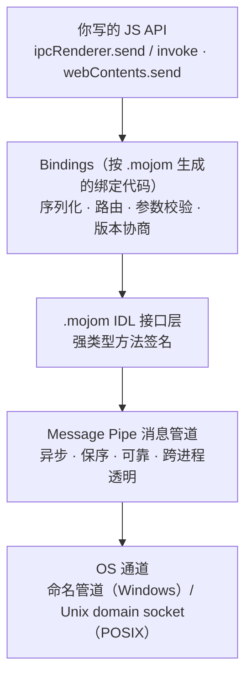

| 层 | 是什么 | 类比 |
|---|---|---|
| Message Pipe | 一条异步、保序、可靠的通道，两端各持一个"句柄"，不关心两端在哪个进程 | 一根专线电话 |
| .mojom IDL | 文本定义的强类型接口，编译时生成绑定代码 | 通话内容的标准单据模板 |
| Bindings | 生成的代码负责序列化、路由、校验 | 快递分拣系统 |

看一段概念简化版的 `.mojom`（示意 Electron 内部的真实结构）：

```
// electron.mojom（概念简化版）
module electron.mojom;

interface Frame {                    // 渲染进程 → 主进程的接口
  // send 与 invoke 共用同一个"通用消息信封"
  Message(bool sync, string channel, array<uint8> serializedArgs)
      => (array<uint8> serializedReply);   // "=>" = 异步回复
}
```

把它和你写过的 API 对上：

| 你写的 API | Mojo 层实际发生的 |
|---|---|
| `ipcRenderer.send(ch, x)` | 调 `Message(sync=false, ch, 序列化(x))`，不等回复 |
| `ipcRenderer.invoke(ch, x)` | 同上，但**等待 `=>` 回复**——mojom 里的异步回复就是你手里 Promise 的来源；handler 抛错 → reject |
| `webContents.send(ch, x)` | 方向反转：主进程调用渲染端接口（`webContents` 就是那条管道的句柄，所以必须传它） |
| `MessageChannelMain` | 见下面的"句柄传递" |

**第 3 层：Mojo 的魔法——句柄可以塞进消息里递给对方。** 一个 message pipe 的端点本身可以作为字段装进另一条消息发送，收到的一方从此持有新管道的一端，双方直连：

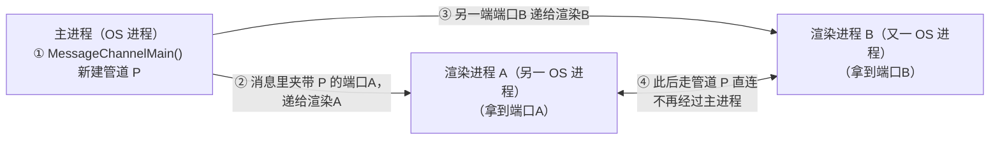

Electron 的 `MessagePort` 就是把这条原语直接暴露给 JS——"两个渲染进程绕过主进程直连"的底层依据。

**第 4 层：序列化。** Electron IPC 用 V8 自带 ValueSerializer——与浏览器 `postMessage` 的结构化克隆同一套算法（详见 §5.2）。代价模型：每条消息 = 序列化 + 管道写入 + 进程唤醒 + 反序列化，所以高频小消息应攒批发送。另有一个禁区 `ipcRenderer.sendSync`：渲染进程阻塞自己的事件循环等回复，页面冻结、易死锁，**永远别用**——它的存在恰好说明跨进程通信在物理上没有"免费同步"的选项。

**专题：`webContents.send` 的逐跳原理（主进程 → 渲染进程推送）**

`webContents` 是主进程 JS 手里"某个渲染进程里那张页面"的遥控器——C++ 层持有该渲染进程 **Mojo 管道的专属句柄**（这就是 `send` 必须挂在某个 `webContents` 上调用的原因）。一次 `send` 五步走：① 主进程侧用 V8 ValueSerializer 把载荷结构化克隆成字节；② 打成 `{频道名, 字节}` 的信封；③ 写入这条 webContents **专属**的管道（定向投递，不广播）；④ 写完立即返回——异步、无回执、无失败通知；⑤ 渲染进程被内核唤醒，Mojo 运行时在事件循环里取消息、反序列化，按频道名查 **preload 世界**的 `ipcRenderer` 监听表，逐个调用。

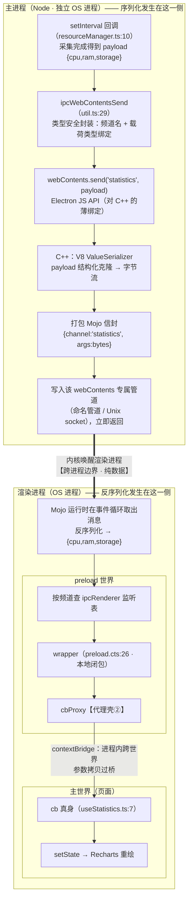

一次推送要过**两道边界、两轮序列化**：主进程侧克隆一次（IPC 用），过桥时再拷一次（contextBridge 用）。

| 特性 | 说明 | 对本项目的影响 |
|---|---|---|
| **定向投递** | 每个 webContents 一条专属管道，`send` 只发给它；跨窗口广播要自己遍历 `BrowserWindow.getAllWindows()` | 单窗口，无感 |
| **保序** | 单条 Mojo 管道天然 FIFO，先 `send` 的先到 | 500ms 一条的 statistics 顺序稳定 |
| **异步无回执** | 写入管道即返回，不等待、不知道对方是否处理 | 想要"主→渲染请求-响应"需自己拼：`send` + `ipcMain.on` 回执频道；或用 `webContents.executeJavaScript`（返回 Promise） |
| **帧路由** | 默认送到该 webContents 的主 frame；子 frame 用 `sendToFrame` | 单 frame 页面，无感 |
| **销毁陷阱** | 目标已销毁会抛错，发送前判 `isDestroyed()` | 隐藏到托盘时窗口仍存活（只是 hide），不受影响；真正 destroy 后才需防御 |

管道与窗口**一对一**——两个窗口就是两条互不相通的管道（想直连要用 MessagePort，见 §5.1.2 句柄传递）：

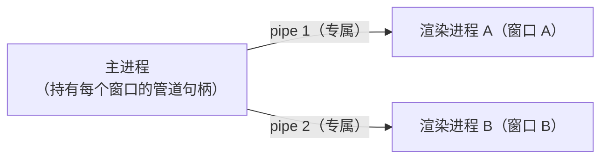

#### 5.1.3 函数代理：跨世界的"替身函数"

**定义：函数代理 = 一个替身函数——你调用它，它负责把参数搬到对岸、调用真正的原函数、再把结果搬回来。**

先用 JS 自带的 `Proxy` 60 秒感受"代理"概念：

```js
function hello(name) { return `hello ${name}`; }

const p = new Proxy(hello, {
  apply(target, thisArg, args) {
    console.log('有人调用了，参数：', args);   // 中转站可以"做手脚"
    return target(...args);                    // 转发给真身
  },
});

p('world');   // 打印拦截日志，返回 "hello world"
```

contextBridge 的函数代理同理，但实现在 **C++ 层**。`exposeInMainWorld` 遍历 api 对象，为每个函数在**主世界**造一个"壳"；调用壳时：参数按结构化克隆语义**拷贝**过桥 → preload 世界执行真身 → 返回值/Promise **拷贝**回程。四个特征：

1. **身份不同**：`window.electron.getStaticData !==` preload 里定义的原函数（不同世界的不同对象）；
2. **闭包留在对岸**：替身不携带状态，真身及其闭包里的 `ipcRenderer` 永不离开 preload 世界；
3. **`toString()` 看不出源码**：返回 `function () { [native code] }`——壳是 C++ 造的；
4. **不可篡改**：海关本身在 C++ 层，两个世界的 JS 都改不了它。

**双向都成立**：UI 把 `cb` 传给 `subscribeStatistics(cb)` 时，`cb` 过桥后也变成一个**反向代理**（preload 世界持有的壳）。看这张五泳道时序图（"C++ 海关"泳道 + 每个函数的身份标注；注意前三个泳道同属一个渲染进程）：

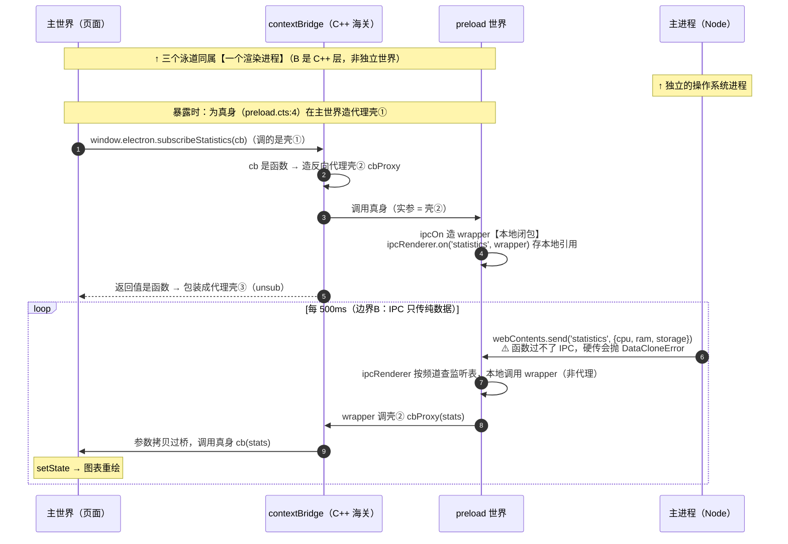

**关键结论：IPC（边界 B）不把任何函数包装成代理——它是纯数据通道，函数硬传直接抛 `DataCloneError`。函数代理的唯一产地是 contextBridge（边界 A）。** statistics 链路共 7 个函数，只有 3 个是代理：

| 函数 | 位置 | 身份 |
|---|---|---|
| `subscribeStatistics` 真身 | `preload.cts:4` | 本地函数（preload 世界） |
| `window.electron.subscribeStatistics` | 主世界 | **代理壳①**（暴露时包装） |
| `cb` 真身 | `useStatistics.ts:7` | 本地函数（主世界） |
| `cbProxy` | preload 世界 | **代理壳②**（cb 作实参过桥时包装，反向代理） |
| `wrapper` | `preload.cts:26` | 本地闭包（捕获壳②） |
| unsub 真身 | `preload.cts:28` | 本地函数 |
| 主世界拿到的 `unsub` | `useStatistics.ts:18` | **代理壳③**（返回值过桥时包装） |

主进程侧另有两个纯本地函数：`setInterval` 回调（`resourceManager.ts:10`）、`ipcMain` 的各 handler（`main.ts:24/28`，主进程监听表持有引用）。

推送期的函数身份与两道边界（数据流图）：

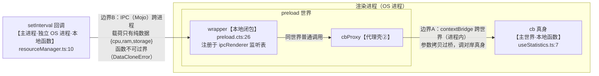

即：**数据每 500ms 过两道边界**（IPC 跨进程一次 + contextBridge 跨世界一次）；函数则各守各家——代理壳成对地立在 contextBridge 两侧，谁也不跨 IPC。

#### 5.1.4 contextBridge 举例（含 20 行玩具版）

**例 1：正确姿势 vs 危险姿势**

```js
// ❌ 危险：把通用入口（ipcRenderer）整个透传 = 把所有后门开放给网页
contextBridge.exposeInMainWorld('ipc', ipcRenderer)

// ✅ 安全：只暴露语义化动词，页面能做的事被白名单写死
contextBridge.exposeInMainWorld('api', {
  openFile: () => ipcRenderer.invoke('openFile'),   // 返回 Promise
})
```

**例 2：拷贝语义——暴露的是"快照"不是"引用"**

```js
// preload 世界
const state = { count: 0 };
contextBridge.exposeInMainWorld('state', state);
state.count = 99;

// 主世界（页面）
window.state.count    // 仍是 0！暴露那一刻深拷贝，之后的修改不会同步
```

结论：**别暴露可变数据，暴露读取数据的函数**（`getState: () => state`）。

**例 3：20 行玩具版 contextBridge**（DevTools Console 或 Node 17+ 可直接运行），海关的核心就一个 `proxyFn`：

```js
// ===== 玩具版 contextBridge =====

// ① 两个世界（模拟两个互不可见的 V8 Context，真实中它们同属一个渲染进程）
const preloadWorld = {
  listeners: {},
  ipcOn(ch, handler) { (this.listeners[ch] ??= []).push(handler); },
  push(ch, payload)  { this.listeners[ch]?.forEach((h) => h(payload)); }, // 模拟主进程推送
};

// ② 海关：函数 → 换成代理；其他数据 → 深拷贝（"结构化克隆 + 函数例外"）
const across = (v) => (typeof v === 'function' ? proxyFn(v) : structuredClone(v));
function proxyFn(fn) {                    // ★ 跨世界函数代理，contextBridge 的灵魂
  return (...args) => {
    const result = fn(...args.map(across));   // 参数过桥 → 对岸执行
    return across(result);                    // 结果回程过桥
  };
}

// ③ preload 定义 API（对应 preload.cts）
const api = {
  subscribeStatistics: (cb) => {              // cb 已是主世界函数的反向代理
    const wrapper = (stats) => cb(stats);     // 对应 preload.cts:4 的 wrapper
    preloadWorld.ipcOn('statistics', wrapper);
    return () => {};                          // unsub
  },
};

// ④ 暴露到主世界（对应 exposeInMainWorld）
const mainWorld = { electron: { subscribeStatistics: proxyFn(api.subscribeStatistics) } };

// ===== 页面侧使用（对应 useStatistics.ts）=====
mainWorld.electron.subscribeStatistics((s) => console.log('图表更新:', s));
preloadWorld.push('statistics', { cpu: 0.42, ram: 0.61, storage: 0.55 });
// 输出：图表更新: { cpu: 0.42, ram: 0.61, storage: 0.55 }
```

与真实实现的三点差异：

| 玩具版 | 真实 contextBridge |
|---|---|
| `structuredClone` 拷贝数据 | C++ 层 V8 序列化器（同一语义） |
| JS 写的 `proxyFn`（理论上可被改） | C++ 实现，任何世界都无法篡改 |
| 两个普通对象假装两个世界 | 真的是同进程内两个独立 V8 Context，各自全套内建 |

细节：`structuredClone` **不能克隆函数**——所以海关必须先把函数手工换成代理、剩下的才交给克隆，这正是 `across` 第一行干的事，也是"函数例外、其余拷贝"规则的由来。

**例 4：contextIsolation ≠ sandbox（两条防线互补）**

| 机制 | 隔离的是什么 | 层级 |
|---|---|---|
| `contextIsolation` | JS 对象/原型链互不可见（防原型污染偷特权对象） | V8 Context 级（**同进程**） |
| `sandbox: true` | 渲染进程做不了系统调用、没有 Node | **操作系统进程级** |

本项目两个都开着（吃默认值），纵深防御。三级隔离阶梯（同世界 / 同进程跨世界 / 跨进程）见 §4.2「进程归属」。

#### 5.1.5 一次 `MINIMIZE` 的完整调用栈（数据流图）

把原理拼起来——从按钮点击到窗口最小化，8 步穿过两道边界、三次语言层切换（JS→C++→JS→C++管道→C++→JS）。注意两道边界的位置：⑤ 才是真正的进程边界：

```mermaid
flowchart TB
    subgraph REND["渲染进程（OS 进程 A）"]
        subgraph MWW["主世界"]
            S1["① onClick（App.tsx:106）<br/>window.electron.sendFrameAction('MINIMIZE')"]
        end
        S2["② contextBridge（C++ 海关，进程内跨世界）<br/>'MINIMIZE' 深拷贝过桥"]
        subgraph PWW["preload 世界"]
            S3["③ ipcSend（preload.cts:31）<br/>ipcRenderer.send(...)"]
            S4["④ V8 ValueSerializer 序列化打包"]
            S3 --> S4
        end
        S1 --> S2 --> S3
    end
    S4 -->|"⑤ Mojo：命名管道 / Unix domain socket<br/>【跨进程边界】"| S5
    subgraph MAINP["主进程（OS 进程 B · Node.js）"]
        S5["⑥ 内核唤醒，事件循环取消息、反序列化"]
        S7["⑦ ipcMainOn（util.ts:23）<br/>validateEventFrame 校验来源"]
        S8["⑧ switch('MINIMIZE')<br/>mainWindow.minimize()"]
        S5 --> S7 --> S8
    end
```

### 5.2 IPC 是什么、本质是什么

IPC = Inter-Process Communication。主进程和渲染进程是两个操作系统级进程，内存空间完全隔离，只能靠**消息传递**通信。底层是 Chromium 的 Mojo IPC（见 §5.1.2），对上层暴露成三对极简 API。

关键认知：**消息是被序列化传输的**（结构化克隆算法，structured clone）：

- ✅ 能传：JSON 能传的一切 + `Map/Set/Date/TypedArray/Blob`
- ❌ 不能传：**函数**（直接抛 `DataCloneError`——函数代理是 contextBridge 的专利，与 IPC 无关）、DOM 节点、Promise；class 实例能传但原型链被剥掉，变成普通对象

### 5.3 三种通信形态 —— IPC 的全部

| 形态 | API 配对 | 方向 | 语义 | 本项目示例 |
|---|---|---|---|---|
| ① 请求-响应 | `ipcRenderer.invoke` ↔ `ipcMain.handle` | R→M | 要一个返回值（Promise） | `getStaticData` |
| ② 单向消息 | `ipcRenderer.send` → `ipcMain.on` | R→M | 发个命令，不等结果 | `sendFrameAction`（窗控按钮） |
| ③ 主动推送 | `webContents.send` → `ipcRenderer.on` | M→R | 主进程主动通知页面 | `statistics`（500ms 轮询）、`changeView`（菜单切视图） |

**选型直觉**：

- 要拿到数据才能继续 → ①（`invoke` 自带错误传播：`handle` 里 `throw`，`invoke` 的 Promise 就 `reject`）
- 像"按下按钮"这种命令 → ②
- 定时刷新、事件通知 → ③
- 长流式对话 → ① 建立会话 + ③ 持续推送的组合（或用 MessagePort）

### 5.4 三种形态的全链路时序图

三张时序图统一采用 `主世界（React）→ preload 世界 → 主进程（Node）` 三个泳道；**前两个泳道同属一个渲染进程，第三个泳道是独立 OS 进程**——每张图开头都标注了这条进程分界线。

#### ① invoke / handle —— 请求-响应

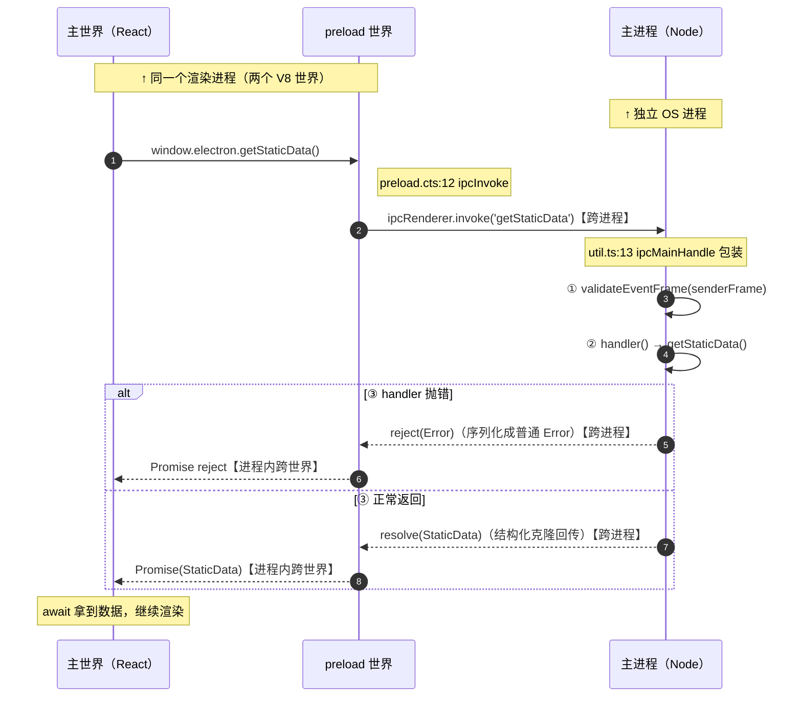

```ts
// 渲染层（App.tsx:116 useStaticData）
const data = await window.electron.getStaticData()  // StaticData 类型全程贯通

// 主进程（main.ts:24）
ipcMainHandle('getStaticData', () => getStaticData());
```

特征：三种形态里唯一有"回程"的；错误沿同一条 Promise 链传播（handle 抛错 → invoke reject，错误对象被序列化成普通 `Error`）。

#### ② send / on —— 单向消息

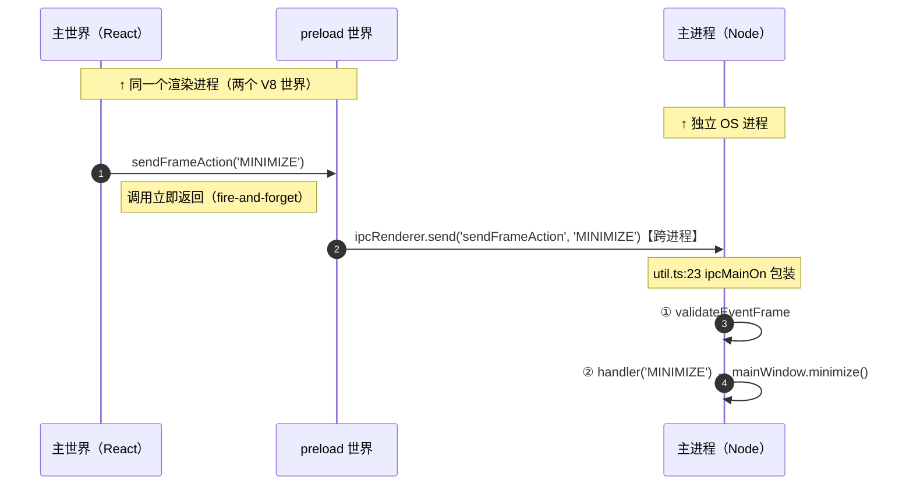

```tsx
// 渲染层（App.tsx:102）：点自绘的关闭按钮
onClick={() => window.electron.sendFrameAction('MINIMIZE')}

// 主进程（main.ts:28）：真正执行窗口操作
ipcMainOn('sendFrameAction', (payload) => {
  switch (payload) {
    case 'MINIMIZE': mainWindow.minimize(); break;
    // ...
  }
});
```

为什么必须绕一圈？渲染进程没有 `minimize()` 的权限——窗口控制在主进程手里。这就是"能力分离 + IPC 申请"的典型体现。特征：fire-and-forget，主进程执行成败，渲染进程无从得知——适合"命令"语义。

#### ③ webContents.send → ipcRenderer.on —— 主进程推送（含订阅生命周期）

推送是三种形态里唯一需要**提前建立订阅关系**的，所以时序分三个阶段：

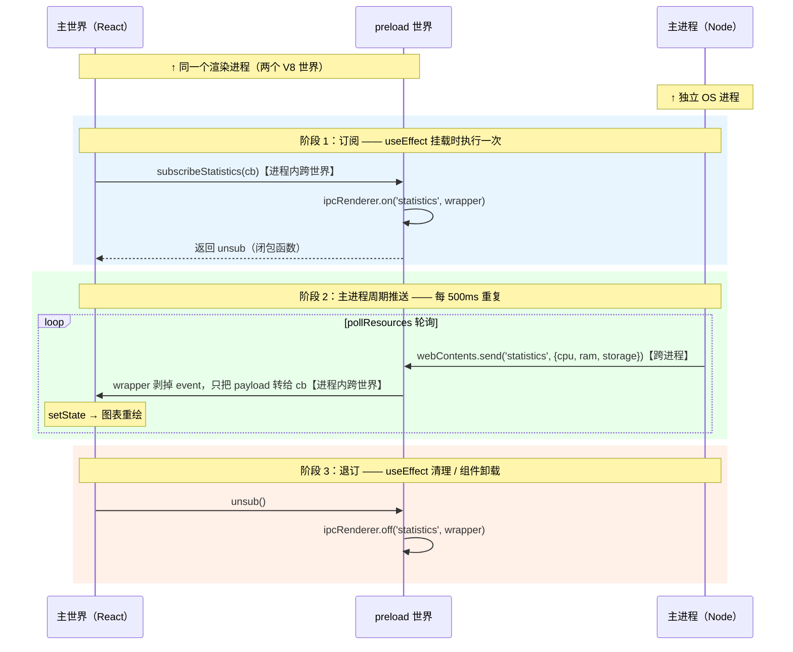

```ts
// 主进程（resourceManager.ts:9）：每 500ms 推一次
setInterval(async () => {
  const cpuUsage = await getCpuUsage(); // ...
  ipcWebContentsSend('statistics', mainWindow.webContents,
                      { cpuUsage, ramUsage, storageUsage });
}, 500);

// 渲染层（useStatistics.ts:3）：订阅 + 滑动窗口保留最近 10 个点
const unsub = window.electron.subscribeStatistics((stats) =>
  setValue(prev => [...prev, stats].slice(-10))
);
return unsub;  // useStatistics.ts:18，useEffect 卸载时取消订阅
```

关键细节：`off` 按**函数引用**匹配，必须传注册时的同一个 `wrapper`（不是 UI 的 `cb`）——所以 `ipcOn`（`preload.cts:22-30`）把 `on/off` 成对封进闭包，调用方想写错都难。React StrictMode 下 effect 会跑两遍，没有这个 unsub 就会重复订阅、泄漏回调。推送的逐跳底层原理（序列化位置、管道定向投递、保序性）见 §5.1.2 专题。

### 5.5 IPC 安全：谁来都能发消息吗？

威胁模型：假设渲染进程已被攻破（比如 XSS），攻击者拿到 `window.electron` 就能伪造 IPC。两道防线，本项目都做了：

**第一道：暴露面最小化**（§4.3，只暴露 4 个白名单方法）

**第二道：主进程验证消息来源**（`util.ts:37`）：

```ts
export function validateEventFrame(frame: WebFrameMain) {
  if (isDev() && new URL(frame.url).host === 'localhost:5123') return; // 开发期放行 Vite
  if (frame.url !== pathToFileURL(getUIPath()).toString()) {
    throw new Error('Malicious event');  // 不是从你的页面发来的 → 拒绝
  }
}
```

每个 `ipcMainHandle` / `ipcMainOn`（`util.ts:13,23`）都先检查 `event.senderFrame.url`：万一窗口里被塞了个 iframe 或打开了别的页面，来自它们的 IPC 会被直接抛错。对应官方安全清单的"校验发件方"条目。

### 5.6 类型安全 IPC —— 本项目的精华模式

IPC 频道名本质是字符串，裸写有三个坑：拼错频道名、载荷结构对不上、两端类型漂移。本项目的解法是**一份类型，三端共享**：

```ts
// types.d.ts:17 —— 全局环境类型（无 import/export），主进程、preload、UI 都天然可见
type EventPayloadMapping = {
  statistics: Statistics;        // 推送
  getStaticData: StaticData;     // 请求-响应
  changeView: View;
  sendFrameAction: FrameWindowAction;
};
```

再用泛型把"频道名 → 载荷类型"绑定死（`util.ts:9`）：

```ts
export function ipcMainHandle<Key extends keyof EventPayloadMapping>(
  key: Key,
  handler: () => EventPayloadMapping[Key]
) { ... }
```

效果：频道名拼错、payload 多传/少传字段、返回类型不符——**全部编译期报错**。preload 的 `ipcInvoke/ipcOn/ipcSend`（`preload.cts:16-36`）用同样的泛型做镜像约束。

> 💡 以后写任何 Electron 项目都可以直接复用这套 **`types.d.ts` + `util.ts` + `preload.cts` 三件套**。

### 5.7 高级话题（知道即可）

- **`MessageChannelMain` / `MessagePort`**：让两个渲染进程之间建立**直连通道**，主进程只当一次"介绍人"，之后数据不再路过主进程（底层原理见 §5.1.2 的"句柄传递"）。
- **`webContents.send` 到已销毁窗口**会抛错，推送前判断 `webContents.isDestroyed()`（本项目的轮询存在此隐患：隐藏到托盘后仍持续推送）。

### 5.8 IPC 常见坑清单

1. 传函数/类实例过 IPC → 结构化克隆会丢函数、剥原型链。
2. `handle` 里抛的自定义 Error 到 `invoke` 端被序列化成普通 `Error`，`instanceof MyError` 失效——错误信息用约定字段传。
3. 忘记 `off` 取消订阅 → 重复订阅泄漏（本项目的 unsub 模式是解法）。
4. 主进程做同步重活（大文件 `readFileSync`、CPU 密集计算）会卡死**所有** IPC → 挪到 Utility Process 或 worker。
5. 频道名字符串散落各处 → 用 `EventPayloadMapping` 这种映射表收敛。

---

## 6. 一条 CPU 数据的一生（串联全部概念）

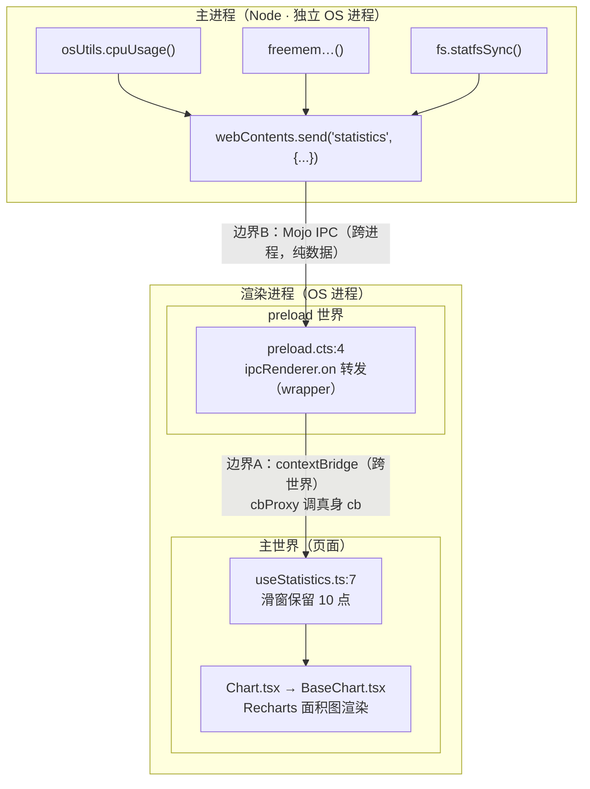

四条链路覆盖全部三种 IPC 形态：

| 链路 | 形态 |
|---|---|
| 启动时拉取 CPU 型号/总内存/总磁盘（`getStaticData`） | ① invoke/handle |
| 点窗控按钮最小化/最大化/关闭（`sendFrameAction`） | ② send/on |
| 500ms 资源推送（`statistics`） | ③ webContents.send |
| 菜单切换视图（`changeView`） | ③ webContents.send |

## 7. 动手练习（改这个仓库）

1. 新增一个 ① invoke 频道：`getPlatform`，返回 `process.platform`，在 UI 显示当前系统。
2. 给 ② `sendFrameAction` 加一个 `'MAXIMIZE_UNDO'`（`unmaximize()`）。
3. 把 `pollResources` 改成可启停（IPC 控制 `setInterval`），修掉"托盘隐藏后仍在推送"的问题。
4. 跑一遍 §5.1.4 的玩具版 contextBridge，然后给它加上"频道白名单校验"，模拟 `validateEventFrame` 的思路。
5. 用 §4.2 的四个验证实验，向自己证明 preload 世界与页面同进程：preload 里加 `console.log`、DevTools 跑 `while(true){}`、打开 Electron 任务管理器。

## 8. 官方资源

- 进程模型：<https://www.electronjs.org/docs/latest/tutorial/process-model>
- IPC 教程：<https://www.electronjs.org/docs/latest/tutorial/ipc>
- Context Isolation：<https://www.electronjs.org/docs/latest/tutorial/context-isolation>
- 安全清单：<https://www.electronjs.org/docs/latest/tutorial/security>
- Preload 沙箱可用 API：<https://www.electronjs.org/docs/latest/api/sandboxed-preload>
- contextBridge API：<https://www.electronjs.org/docs/latest/api/context-bridge>
