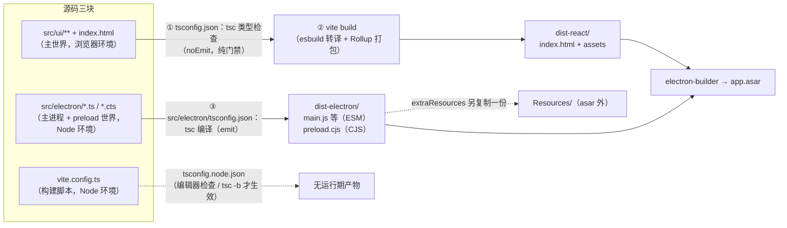
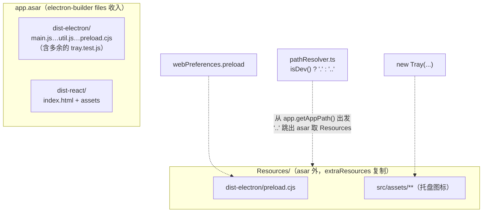

# 构建与工程化详解：三份 tsconfig 的分工

> 配套阅读：[ARCHITECTURE.md](./ARCHITECTURE.md)（项目全貌，§5 工程化细节 / §7 构建分发）、[ELECTRON-GUIDE.md](./ELECTRON-GUIDE.md)（进程模型与 IPC 原理）。
> 术语遵循 [conventions/terminology.md](./conventions/terminology.md)；图表为 Mermaid。
> 本文以 `tsconfig.json`、`tsconfig.node.json`、`src/electron/tsconfig.json` 三份配置为主线，讲清"一份源码如何变成可分发的桌面应用"。

---

## 0. 全景：一份源码、两条编译管线、三份 tsconfig

本仓库的核心工程化事实：**没有单一的"编译入口"**。UI 归 Vite，主进程归 tsc，两者环境不同（浏览器 vs Node）、模块格式不同（浏览器 ESM vs NodeNext）、产出方式不同（打包 vs 逐文件转译）。三份 tsconfig 正是对这条分界线的声明：



"谁管谁"总表：

| 文件/目录 | 归哪份 tsconfig | 模拟环境 | 类型检查时机 | 产物 |
|---|---|---|---|---|
| `src/ui/**` | `tsconfig.json` | 浏览器（Chromium） | `npm run build` 里的 `tsc` | 无（Vite 出 `dist-react/`） |
| `src/electron/**` | `src/electron/tsconfig.json` | Node / preload | `transpile:electron`（边查边编） | `dist-electron/*.js` + `preload.cjs` |
| `vite.config.ts` | `tsconfig.node.json` | Node | **仅编辑器内**（`tsc -b` 才会真查） | 无 |
| `types.d.ts` | 三份都用 `types` 字段注入 | — | 随各项目 | —（ambient 全局类型） |
| `playwright.config.ts` | ❌ **不属于任何 tsconfig** | Node | 无（编辑器"孤立项目"） | — |

---

## 1. `tsconfig.json`（根）—— UI 层的"门禁"

`include: ["src"]` + `exclude: ["src/electron"]` 圈定管辖范围：只剩 `src/ui/**`。逐组解读 compilerOptions：

### 1.1 环境定义（"我是谁、我在哪"）

| 选项 | 值 | 为什么 |
|---|---|---|
| `lib` | `DOM, DOM.Iterable, ESNext` | UI 跑在 Chromium：要有 DOM 类型 + 最新 ES；**刻意不给 Node 类型** |
| `types` | `["./types"]` | 只注入根目录 `types.d.ts` 的全局类型（`window.electron`、`EventPayloadMapping`）。副作用：`@types/*` 不再自动全量注入——UI 代码里写 `process.env` 会**编译报错**，这正是想要的效果（主世界运行时根本没有 `process`） |
| `jsx` | `react-jsx` | 自动 JSX runtime，组件里不用 `import React` |
| `target` / `useDefineForClassFields` | `ESNext` / `true` | 只影响类型检查基线；实际语法降级由 Vite 的 `build.target` 决定 |

### 1.2 模块策略（"模块给谁处理"）

| 选项 | 值 | 为什么 |
|---|---|---|
| `module` / `moduleResolution` | `ESNext` / `Node` | 模块图交给 Vite 解析打包，不需要 Node 原生 ESM 的严格规则（比如 import 不必写扩展名） |
| `isolatedModules` | `true` | Vite 用 esbuild **逐文件**转译，要求每个文件可独立编译——禁止跨文件的 const enum 擦除等依赖整图的操作。这个开关把"Vite 的约束"前移到类型检查阶段 |
| `esModuleInterop` / `allowSyntheticDefaultImports` | `false` / `true` | 类型层面放行 `import x from 'cjs包'` 的默认导入写法；实际运行时互操作由 Vite/esbuild 兜底（它总是做 CJS interop）。因为 `noEmit`，`esModuleInterop: false` 不影响任何产物 |

### 1.3 产出职责与防御

| 选项 | 值 | 为什么 |
|---|---|---|
| `noEmit` | `true` | **本配置只当门禁，不产出任何文件**——产物是 Vite 的事。`npm run build` = `tsc && vite build`：先类型门禁，过不了就不进入构建 |
| `forceConsistentCasingInFileNames` | `true` | Windows 文件系统大小写不敏感、Linux 敏感；此开关禁止 `import './App'` 与 `./app.tsx` 混用大小写，防跨平台协作炸裂 |
| `strict` / `skipLibCheck` | `true` / `true` | 全严格模式；跳过依赖包 `.d.ts` 的深检（提速） |

### 1.4 `references`：把 vite.config.ts 挂进来

```json
"references": [{ "path": "./tsconfig.node.json" }]
```

这是 TS 的 **Project References** 机制：声明"根项目引用了另一个独立编译单元"。关键细节见下一节——**普通 `tsc` 并不会真的去检查被引用项目**。

---

## 2. `tsconfig.node.json` —— 只为 `vite.config.ts` 服务

```json
{
  "compilerOptions": {
    "composite": true,
    "module": "ESNext",
    "moduleResolution": "Node",
    "allowSyntheticDefaultImports": true
  },
  "include": ["vite.config.ts"]
}
```

**为什么必须单独一份？** `vite.config.ts` 跑在 **Node 环境**（Vite 启动时读取），却不在根配置的 `include: ["src"]` 范围内。若没有专属配置，编辑器会把它当"孤立文件"用默认环境检查（没有 `@types/node` 的 `defineConfig` 就没有类型提示）。这份配置给它正确的环境：Node 类型（来自 devDependencies 的 `@types/node`）+ 不带 DOM 的 lib。

**`composite: true` 是什么？** Project References 的硬性要求——被引用的项目必须 `composite`，意味着：

- 必须能产出 `.d.ts`（声明文件），供引用方做跨项目类型检查；
- 启用增量编译信息（`.tsbuildinfo`）。

**一个容易被误解的细节**：`npm run build` 里的 `tsc`（不带 `-b`）**不会**检查 vite.config.ts——references 只在 `tsc --build` 模式下被级联构建。所以这份配置在本项目的实际作用是：

1. **编辑器类型提示**：VS Code 的 TS Server 会为每个文件挑选"include 覆盖它的那份 tsconfig"，vite.config.ts 因此获得正确的 Node 类型环境；
2. 保持脚手架（create-vite 模板）的标准结构，将来想上 `tsc -b` 增量检查时无需改布局。

---

## 3. `src/electron/tsconfig.json` —— 主进程 + preload 的"发射台"

```json
{
  "compilerOptions": {
    "strict": true,
    "target": "ESNext",
    "module": "NodeNext",
    "outDir": "../../dist-electron",
    "skipLibCheck": true,
    "types": ["../../types"]
  }
}
```

没写 `include`——默认编译**该目录下全部** TS 文件（`main.ts`、`util.ts`、…、`preload.cts`，连同 `tray.test.ts`，见 §5 改进项）。

### 3.1 `module: NodeNext`：整份配置的灵魂

NodeNext = "按 Node 的原生规则来"。它一次性决定了三件事：

| 规则 | 表现 | 在代码里的痕迹 |
|---|---|---|
| **模块格式跟随 package.json** | 根包 `"type": "module"` → 所有 `.ts` 编译为 **ESM** | `package.json` 的 `"main": "dist-electron/main.js"` 交给 Electron 32 按 ESM 加载（Electron 28+ 支持） |
| **import 必须写扩展名** | ESM 相对导入不允许省略 `.js` | `main.ts:2` 的 `from './util.js'`——源码里引用的是 util.ts，写的却是编译后的文件名 |
| **后缀决定格式** | `.cts` → 强制产出 `.cjs`，无视包的 type | `preload.cts` → `preload.cjs`，这是 preload 世界走 CJS 的机制源头（沙箱兼容性最好） |

另外：`module: NodeNext` 隐含 `moduleResolution: NodeNext`（不可另设），并自动启用 Node 风格的 CJS 互操作——所以 `resourceManager.ts:1` 能写 `import osUtils from 'os-utils'`（一个 CJS 包）而类型不报错，运行时 Node ESM 加载 CJS 也正好给出 default 导出。

### 3.2 `types: ["../../types"]` 与一个有趣的细节

和根配置同理：只注入根目录 `types.d.ts`（让 `EventPayloadMapping`、`Window` 等三端共享），屏蔽其他全局类型的自动注入。

**细节**：这里没列 `"node"`，但 `util.ts:6` 用了全局 `process.env.NODE_ENV` 却不报错——因为主进程每个文件都 `import 'electron'`，而 **electron 包的类型声明内部引用了 node 类型**（`/// <reference types="node" />`），Node 全局类型被"顺丰带货"式地传递进来。这个隐式依赖能工作，但若某天某个文件不 import electron 又用了 Node 全局，就会暴露。

### 3.3 产出结构

`outDir: "../../dist-electron"`，未设 `rootDir` → 以公共根（`src/electron/`）为基准平铺输出：

```
dist-electron/
├── main.js              ← 入口（package.json "main"）
├── util.js / menu.js / tray.js / pathResolver.js / resourceManager.js
├── preload.cjs          ← 唯一的 CJS（.cts 后缀决定）
└── tray.test.js         ← ⚠️ 单测文件也被编译了（见 §5）
```

---

## 4. 三条脚本链路与最终产物

### 4.1 脚本对照（`package.json`）

| 脚本 | 实际执行 | 三份 tsconfig 的参与 |
|---|---|---|
| `dev` | `npm-run-all --parallel dev:react dev:electron` | 两条子链并行：Vite dev server（5123）+ transpile 后启动 electron（`cross-env NODE_ENV=development`——Windows 兼容地设环境变量） |
| `dev:react` | `vite` | 编辑器里由根 tsconfig 提供 UI 类型提示 |
| `dev:electron` | `tsc --project src/electron/tsconfig.json` + `electron .` | **emit 管线**；`isDev()` 读 NODE_ENV 决定加载 dev server 还是磁盘文件 |
| `build` | `tsc && vite build` | `tsc` = 根配置**纯类型门禁**（noEmit）；`vite build` 产出 `dist-react/`（`base: './'` 相对路径，供 `file://` 加载） |
| `dist:win/mac/linux` | `transpile:electron && build && electron-builder --xxx` | 两个 tsc + 一个 Vite 全跑一遍，再打包 |

### 4.2 产物与打包去向



要点（详见 [ARCHITECTURE.md](./ARCHITECTURE.md) §5.2/§7）：`webPreferences.preload` 与 `Tray` 图标在生产环境都从 **asar 外**的 Resources/ 加载（`extraResources` 复制的那份）；UI 页面则从 asar 内的 `dist-react/index.html` 加载。`files` 与 `extraResources` 的分工 = "进归档的"与"裸放的"。

### 4.3 dev 链路的已知竞态

`npm-run-all --parallel` 下 Electron 可能先于 Vite 就绪而白屏（E2E 场景由 Playwright 的 `webServer.url` 探测解决了，本地 dev 需手动重启）。改进方向：串行等待端口可用后再启动 electron。

---

## 5. 工程化改进清单（结合三份 tsconfig）

1. **`playwright.config.ts` 是配置孤儿**：不属于任何 tsconfig 的 include，编辑器里按默认环境检查、CI 无门禁（`e2e/*.spec.ts` 同理，靠 Playwright 运行时自行转译）。改法：加入 `tsconfig.node.json` 的 `include`（它们同为 Node 环境的构建脚本）。
2. **单测产物混进安装包**：`src/electron/tsconfig.json` 默认 include 整个目录 → `tray.test.js` 被编译并随 `files: ["dist-electron"]` 进入 asar。改法：tsconfig 加 `"exclude": ["*.test.ts"]`，或 electron-builder 的 files 改为 `"!dist-electron/*.test.js"`。
3. **全量重编译**：主进程没有增量编译（无 `incremental`/`tsbuildinfo`），每次 `transpile:electron` 都全量。改法：`tsc --build --watch` 或加 `incremental: true`。
4. **`references` 名存实亡**：想真正启用级联检查，把 `build` 改为 `tsc -b .`（会连同 vite.config.ts 一起检查）。
5. **`test:unit` 是 watch 模式**（`vitest src` 无 `run`），CI 中应改 `vitest run`（既有条目，此处汇总）。
6. **types 路径依赖 electron 传递 node 类型**（§3.2）：更稳的写法是 `types: ["../../types", "node"]` 显式声明。

---

## 6. 逐选项仔细对照：三份 tsconfig 的差异

### 6.1 先看三个结构性事实（比单个选项更重要）

1. **互相独立，零继承**：三份配置都没有 `extends`，没有共享"基配置"。`strict` 就是证据——根配置和 electron 配置各自手写了一遍，node 配置忘了写（吃默认 false）。任何"共同约定"都要复制三份，存在漂移风险。
2. **管辖范围三种写法**：根配置用 `include: ["src"]` + `exclude: ["src/electron"]` 圈地；node 配置精确到单文件 `["vite.config.ts"]`；electron 配置**没写 include**——默认编译配置所在目录下全部文件（含 `tray.test.ts`）。此外 `playwright.config.ts` 与 `e2e/*.spec.ts` 不属于任何一份（Playwright 运行时自行转译 TS，无 tsc 门禁）。
3. **references 是单向的**：根 → node，且仅为"挂名"（普通 `tsc` 不级联检查，见 §2）；electron 完全独立，不参与 references 网络——它是发射台，不是检查单元。

### 6.2 逐选项矩阵（*未设* = 吃默认值；默认值同样在做决定）

**模块与解析**

| 选项 | 根（UI） | node（vite.config） | electron（主进程） | 差异的驱动因素 |
|---|---|---|---|---|
| `module` | ESNext | ESNext | **NodeNext** | 只有主进程要产出"Node 认识的模块格式"；UI 的模块最终形态由 Vite 决定 |
| `moduleResolution` | Node | Node | *未设* → 隐含 **NodeNext** | NodeNext 模式自动配同名解析器，且不可另设 |
| `esModuleInterop` | **false**（显式） | *未设* → false | *未设* → **true**（NodeNext 把默认改写为 true） | 三种状态并存：显式关 / 默认关 / 隐含开 |
| `allowSyntheticDefaultImports` | true | true | *未设* → true（随 interop 隐含） | 前两者显式开，electron 隐含开 |
| `isolatedModules` | **true** | *未设* → false | *未设* → false | 只有 UI 走 esbuild 逐文件转译，需要"每文件可独立编译"保证 |
| `resolveJsonModule` | true | false | false | UI 可能 import JSON 资源 |

**环境与类型注入（差异最大的区域）**

| 选项 | 根（UI） | node | electron | 说明 |
|---|---|---|---|---|
| `lib` | **DOM + DOM.Iterable + ESNext** | *未设*（陷阱见 6.3-③） | *未设*（同左） | 只有根配置显式声明了浏览器环境 |
| `target` | ESNext | *未设* → **默认 ES5** | ESNext | node 永不产出，target 无实际意义 |
| `jsx` | react-jsx | *未设* | *未设* | 只有 UI 有 JSX |
| `types` | `["./types"]` | *未设* → **自动注入全部 @types** | `["../../types"]` | Node 全局类型在三个项目里的来路各不相同（见 6.3-②） |

**严格性**

| 选项 | 根（UI） | node | electron |
|---|---|---|---|
| `strict` | **true** | *未设* → **false** | **true** |
| `forceConsistentCasingInFileNames` | true | false（默认） | false（默认） |
| `skipLibCheck` | true | *未设* → false | true |
| `allowJs` | false（显式，与默认相同） | false（默认） | false（默认） |

**产出与工程机制**

| 选项 | 根（UI） | node | electron |
|---|---|---|---|
| `noEmit` | **true**（纯门禁） | **不能设**（与 composite 冲突） | *未设* → false（**emit**） |
| `outDir` | — | — | `../../dist-electron` |
| `composite` | — | **true**（references 的资格证） | — |
| `useDefineForClassFields` | true（target ESNext 下默认已 true，属冗余显式） | 默认 | 默认 |

### 6.3 缺省陷阱：不写的选项也在做决定

1. **node 不 strict**：默认 false，`vite.config.ts` 是三块代码里检查最松的——零继承结构的直接后果。
2. **Node 全局类型的三条来路**：UI = 被 `types` 屏蔽（写 `process` 编译报错，**刻意**）；node = `types` 未设 → `@types/node` 随"自动注入全部 @types"进来；electron = `types` 设了、没列 node，但 electron 包的 `.d.ts` 内部引用 node 类型而**传递**进来。同一件事（Node 全局可用性），三个项目靠三个不同机制。
3. **未设 lib ≠ 没有 DOM**：TS 的默认 lib 随 target 注入且**都包含 DOM**——node（target 默认 ES5）和 electron（target ESNext）的类型环境里其实都有 DOM。也就是说主进程代码写 `document.title` **类型上不报错**（运行时才炸）。要纯 Node 环境应显式 `lib: ["ESNext"]`。
4. **electron 无 include 的代价**：`tray.test.ts` 被编译并随打包进 asar（§5-2）。
5. **composite 的隐藏开关**：一旦真跑 `tsc -b`，node 项目会连带要求 `declaration` + `incremental`（composite 隐含），开始产出 `.d.ts` 和 `.tsbuildinfo`。
6. **`useDefineForClassFields: true` 是冗余显式**：target ESNext 下默认已是 true，脚手架模板的 habit。

### 6.4 差异的环境驱动总结

| 项目 | 配置形态的根本原因 |
|---|---|
| 根（UI） | 浏览器环境（lib DOM、屏蔽 Node 全局）+ bundler 接管模块与产物（noEmit + isolatedModules）+ JSX |
| node | 只为编辑器提示存在的最小配置；composite 只是换取 references 资格，其余全吃默认（于是 strict、lib 都"漏"了） |
| electron | 唯一要"真产出"的项目：NodeNext 决定 ESM / .cts→.cjs / 扩展名三规则，outDir 给 electron-builder 供料 |
